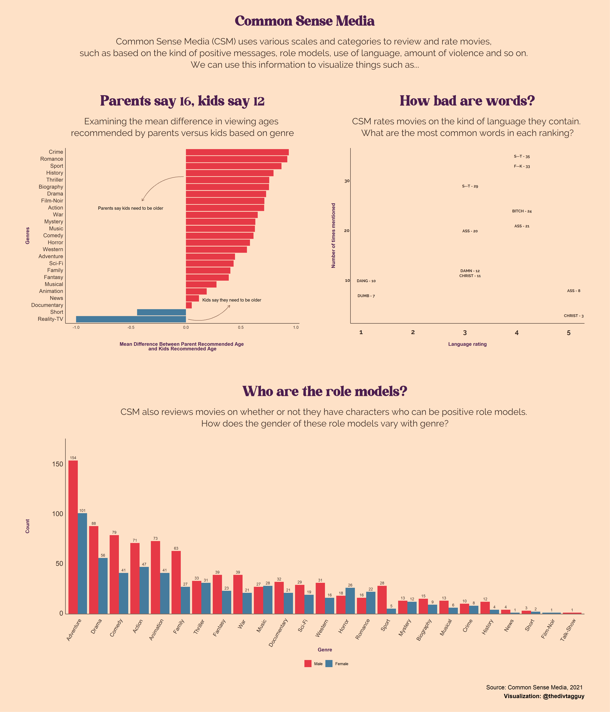

# Daily Data 02
## Common Sense Media

| Date       	| Dataset Description                                                                                                	| Source                                                                                              	|
|------------	|--------------------------------------------------------------------------------------------------------------------	|-----------------------------------------------------------------------------------------------------	|
| 13-11-2021 	| 11,000 movie reviews and ratings on various categories (language, nudity, positive messages, etc.) from Common Sense Media 	| https://github.com/thedivtagguy/movie-ratings 	|

### Log 

- Wrote a scraper to collect data from Common Sense Media's website
- Tidied data, cleaned up text
- Wrote script to identify named entities and count them by genre
- Plotted Mean age difference, learnt how to use annotations
- Developed color palette from coolors.co
- Themed age plot
- Plotted words in ratings, learnt geom_text()
- Plotted gender division in genres
- Patchwork plot
- Cleaned up font sizes, margins
- Generated high-res image

## License 

This data belongs to [Common Sense Media](commonsensemedia.org) and should not be used for any commercial and/or non-academic purposes. If you make use of this dataset either as a whole or create a visualization based on this data, it is necessary to upload it with the following attribution: 

Copyright (c) 2021 Common Sense Media

<a property="dct:title" rel="cc:attributionURL" href="https://github.com/thedivtagguy/movie-ratings">Common Sense Media Dataset</a> by <a rel="cc:attributionURL dct:creator" property="cc:attributionName" href="https://github.com/thedivtagguy/">Aman Bhargava</a> is licensed under <a href="http://creativecommons.org/licenses/by-nc/4.0/?ref=chooser-v1" target="_blank" rel="license noopener noreferrer" style="display:inline-block;">CC BY-NC 4.0</a>
